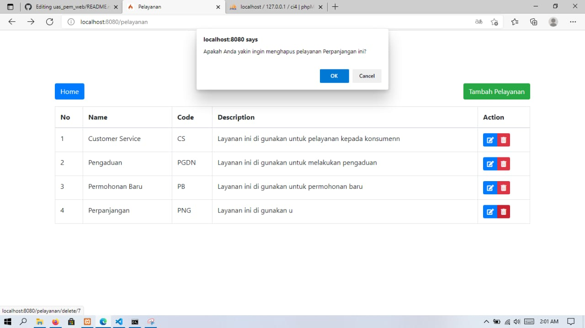

# UAS_PEMR_WEB
# UAS PEMROGRAMAN WEB
# SISTEM ANTRIAN BERBASIS WEB 
# MENGGUNAKAN FRAMWORK CODEIGNITER 4
# NAMA = MIFTAHUL JANNAH
# KELAS = TI19B2
# NIM = 311910740

# DEMO
http://54.254.248.107/ci-miftah/public/

# Tampilan index.php atau UI

# Tampilan Antrian

# Tampilan Setelah Mengambil Antrian

# Tampilan No Antrian

# Tampilan Pelayanan

# Tampilan Tambah Pelayanan

# Tampilan Edit Pelayanan

# Tampilan Delete Pelayanan

# Tampilan Loket

# Tampilan Panggilan Antrian di Loket

